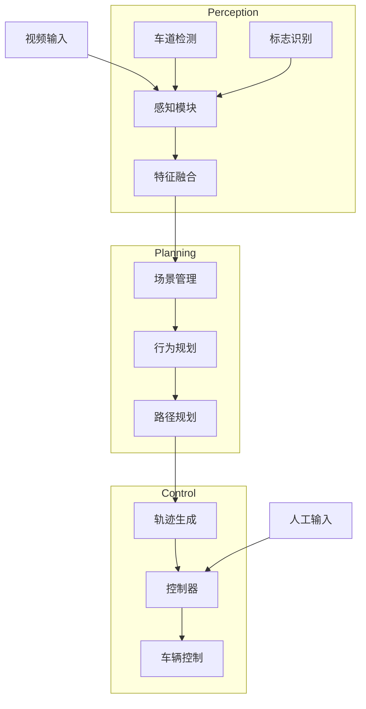
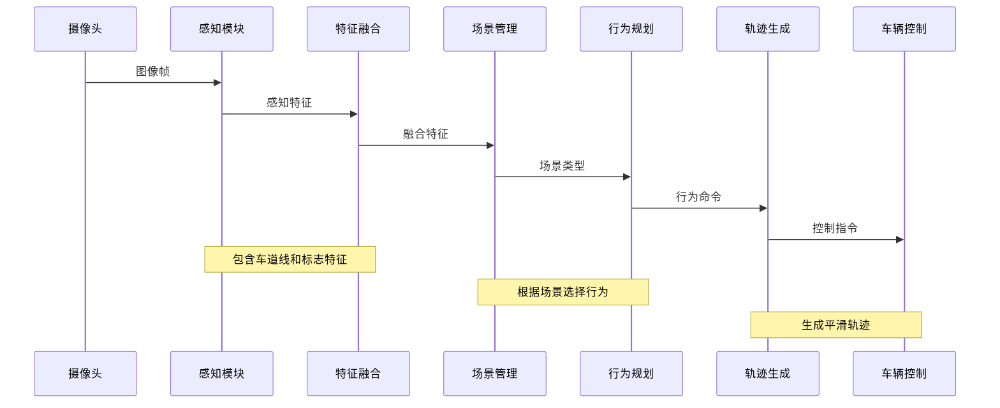

# 自动驾驶系统

这是一个基于计算机视觉的自动驾驶系统，包含感知、规划和控制三大模块，支持车道线检测、交通标志识别、行为规划和轨迹控制等功能。

## 目录
- [自动驾驶系统](#自动驾驶系统)
  - [目录](#目录)
  - [参数配置指南](#参数配置指南)
    - [1. 系统全局参数](#1-系统全局参数)
    - [2. 感知模块参数](#2-感知模块参数)
      - [车道线检测参数](#车道线检测参数)
      - [交通标志检测参数](#交通标志检测参数)
    - [3. 规划模块参数](#3-规划模块参数)
    - [4. 控制模块参数](#4-控制模块参数)
  - [使用说明](#使用说明)
    - [基本用法](#基本用法)
    - [常用参数说明](#常用参数说明)
    - [不同场景示例](#不同场景示例)
  - [系统架构](#系统架构)
    - [系统流程图](#系统流程图)
    - [模块说明](#模块说明)
    - [数据流](#数据流)
    - [调试与监控](#调试与监控)


## 参数配置指南

系统的所有配置参数都在`config.yaml`文件中，按模块划分。以下是关键参数的调整指南：

### 1. 系统全局参数

```yaml
system:
  logging:
    level: "INFO"    # 调试时建议设置为"DEBUG"
```

### 2. 感知模块参数

#### 车道线检测参数
```yaml
perception:
  lane_detector:
    roi_width: 400          # 感兴趣区域宽度
    roi_height: 100         # 感兴趣区域高度
    threshold: 200          # 二值化阈值
```

调整建议：
- 如果车道线检测不稳定：降低`threshold`值（建议范围：150-250）
- 如果检测到虚假车道线：增加`threshold`值
- 如果图像质量较差：增加`roi_height`来获取更多信息

#### 交通标志检测参数
```yaml
  sign_detector:
    confidence_threshold: 0.7     # 置信度阈值
    min_sign_area: 500           # 最小标志面积
```

调整建议：
- 如果漏检标志：降低`confidence_threshold`（不建议低于0.5）
- 如果出现误检：增加`confidence_threshold`或`min_sign_area`

### 3. 规划模块参数

```yaml
planning:
  behavior_planner:
    cruise_speed: 30            # 巡航速度(km/h)
    emergency_decel: -3.0       # 紧急减速度(m/s²)
```

调整建议：
- 初次测试建议将`cruise_speed`设置在20-30km/h
- `emergency_decel`参数影响紧急制动性能，根据实际路况调整

### 4. 控制模块参数

```yaml
control:
  controller:
    # 速度PID参数
    speed_kp: 1.0
    speed_ki: 0.1
    speed_kd: 0.05
    
    # 转向PID参数
    steering_kp: 1.5
    steering_ki: 0.0
    steering_kd: 0.1
```

调整建议：
1. 速度控制调整顺序：
   - 先调`speed_kp`直到车辆能大致跟随目标速度
   - 添加`speed_ki`消除稳态误差
   - 最后微调`speed_kd`改善动态响应

2. 转向控制调整顺序：
   - 先调`steering_kp`直到车辆能跟随车道线
   - 通常不需要太大的`steering_ki`
   - 适当的`steering_kd`可以减少振荡

## 使用说明

### 基本用法

1. 最简单的启动方式：
```bash
python main.py
```

2. 使用摄像头并启用调试模式：
```bash
python main.py --video_source 0 --debug
```

### 常用参数说明

```bash
--debug               # 启用调试模式，显示可视化信息
--video_source        # 视频源 (0为摄像头，或指定视频文件路径)
--record              # 记录视频
--record_filename     # 记录的视频文件名
--strategy            # 驾驶策略 [single/double/manual/cnn]
--input_mode         # 输入模式 [auto/manual/hybrid]
```

### 不同场景示例

1. 使用预录制视频测试：
```bash
python main.py --video_source test_video.mp4 --debug
```

2. 手动控制模式：
```bash
python main.py --input_mode manual --base_speed 50
```

3. 录制调试视频：
```bash
python main.py --debug --record --record_filename debug_run.mp4
```

4. 使用CNN模型进行标志识别：
```bash
python main.py --strategy cnn --model_path models/sign_cnn.pth
```

## 系统架构

### 系统流程图



### 模块说明

1. **感知模块**
   - 车道线检测：检测和分析车道线位置、形状
   - 交通标志识别：识别和分类交通标志
   - 特征融合：综合不同感知结果

2. **规划模块**
   - 场景管理：识别和管理当前驾驶场景
   - 行为规划：根据场景规划行为策略
   - 路径规划：生成具体的行驶路径

3. **控制模块**
   - 轨迹生成：生成平滑的行驶轨迹
   - 控制器：计算具体的控制指令
   - 输入管理：处理手动控制输入

### 数据流



### 调试与监控

系统提供了完整的调试和监控功能：
- 实时可视化：显示检测结果和规划路径
- 数据记录：保存传感器数据和控制指令
- 参数调整：支持实时调整控制参数
- 手动介入：支持随时切换到手动控制模式